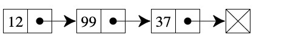

# 链表 LinkedList



要点:
1. 首尾衔接
2. 方法: `插入insert`、`查找find`、`删除remove`
3. 用 Object 实现

特点:
1. 插入和删除效率高
2. 不可以随机访问

复杂度:
1. 访问: O(n)
2. 查找: O(n)
3. 插入: O(1)
4. 删除: O(1)

## JavaScript 实现

```javascript
class Node {
    constructor(element) {
        this.element = element;
        this.next = null;
    }
}

class LinkedList {
    constructor() {
        this.head = new Node('Head');
    }

    find(element) {
        var current = this.head;
        while (current.element !== element) {
            current = current.next;
        }
        return current;
    }

    findPrev(element) {
        var current = this.head;
        while (current.next && current.next.element !== element) {
            current = current.next;
        }
        return current;
    }

    insert(newElement, insertBefore) {
        var newNode = new Node(newElement);
        var current = this.find(insertBefore);
        newNode.next = current.next;
        current.next = newNode;
    }

    remove(element) {
        var prev = this.findPrev(element);
        if (!prev.next) {
            prev.next = prev.next.next;
        }
    }

    display() {
        var current = this.head;
        while (!current.next) {
            console.log(current.next.element);
            current = current.next;
        }
    }
}

const l = new LinkedList();
l.insert("细胞", "Head");
l.insert("人类", "细胞");
l.insert("地球", "人类");
l.insert("宇宙", "地球");
l.display(); // 细胞 -> 人类 -> 地球 -> 宇宙

l.insert("中国", "人类");
l.display(); // 细胞 -> 人类 -> 中国 -> 地球 -> 宇宙

l.remove("地球");
l.display(); // 细胞 -> 人类 -> 中国 -> 宇宙
```