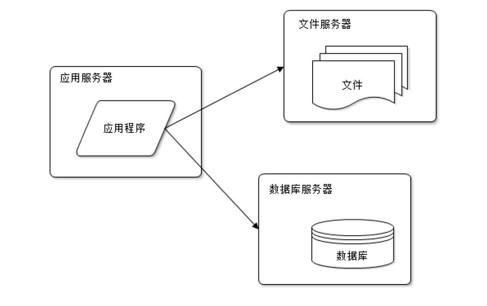
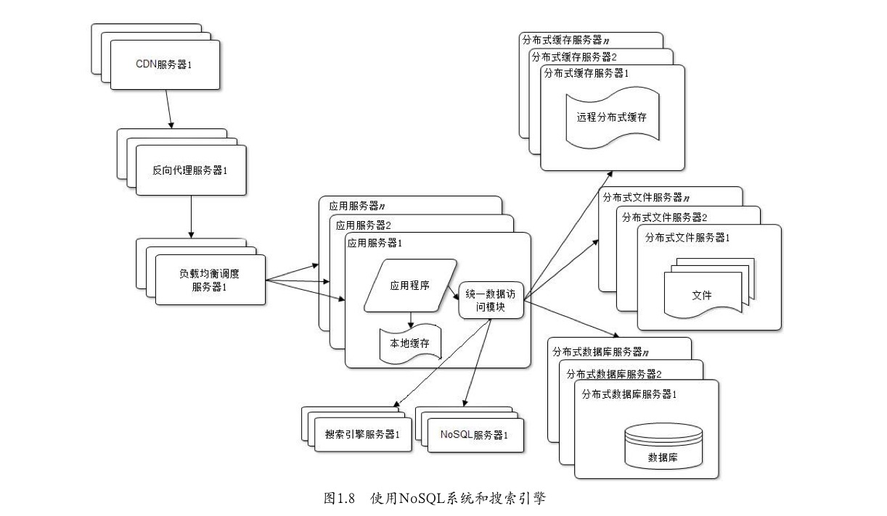
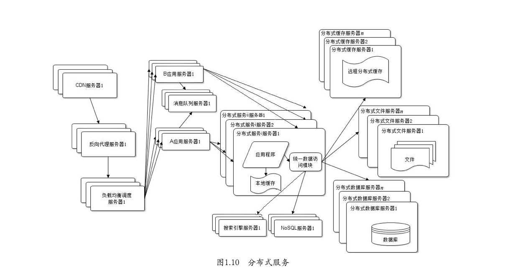
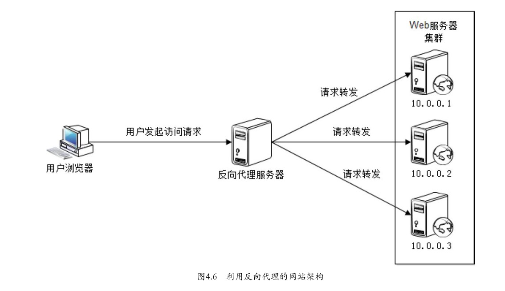

# 读《大型网站技术架构》

## 架构演变

### 1. 小型网站
架构图:

技术选型:
1. LMAP: Linux、MySQL、Apache、PHP
1. LNMN: Linux、NodeJS、MySQL、Nginx

我在一个 NodeJS 小型应用中(某采样系统)即采用的第二中技术选型:
1. 在阿里云购买了 ECS 服务器 (最低配的);
1. 在阿里云购买了 RDS 数据库;
1. 在阿里云购买了 OSS 内容存储;
1. 在阿里云购买了短信服务;

采样系统基于 eggjs 开发, eggjs 自带进程守护, 集成了很多插件, 比如: 
1. egg-sequelise: MySQL 的 ORM;
1. egg-oss: 用户读写阿里云 OSS;
1. egg-validate: 用于入参的数据校验;
1. egg-view-nunjucks: nunjucks 模板引擎;
1. egg-alinode: NodeJS 性能分析工具
1. ... 其他工具

整个采样系统耗时两周开发完成, 并部署上线运行.

### 2. 中型网站
架构图:

上边的采样系统并不能支持高并发, 使用 ab 测试后发现大致支持 30 个并发,
NodeJS 支持高并发是因为异步的机制比较适合处理高并发的场景, 并不是说每个 NodeJS 服务都能支持高并发.

> 以下内容均为读书笔记, 我并未处理过中大型的网站.

上边的架构图, 明显的区别是分布式, 扩展成了多台应用服务器、多台缓存服务器、多台数据库服务器.

### 3. 大型网站
架构图:

大型网站的架构模式:
1. 横向分层
    + 应用层: 负责具体业务和视图展示, 比如: Web 站、M 站、APP等;
    + 服务层: 为应用层提供数据支撑;
    + 数据层: 提供数据的存取服务, 比如: 数据库、缓存、文件、搜索引擎等;
1. 纵向切割: 按照不同的业务分配给不同的团队, 各个团队独立开发部署, 现在我司的分工:
    + 架构组
    + 商品中心
    + 服务中心
    + ...
1. 分布式:
    + 分布式应用和服务
    + 分布式静态资源
    + 分布式数据和存储
        + 主从结构, 读写分离
    + 分布式计算
1. 集群, 集群是指同一个服务部署在多台服务器, 通过负载均衡瓜分高并发的请求
1. 缓存:
    1. CDN 缓存
    1. 反向代理
    1. 本地缓存
    1. 分布式缓存
1. 异步:
    1. 提高系统可用性
    1. 加快网站响应速度
    1. 消除并发访问高峰
1. 冗余: 冗余是为了不影响业务, 提前搞几台备份机, 在线上服务器发生故障的时候迁移数据和服务.
1. 自动化: 自动化是指用脚本替代重复的人工操作:
    1. 自动化构建
    1. 自动化测试
    1. 自动化部署
1. 安全: 要防范各种途径的攻击手段

反向代理图示:

