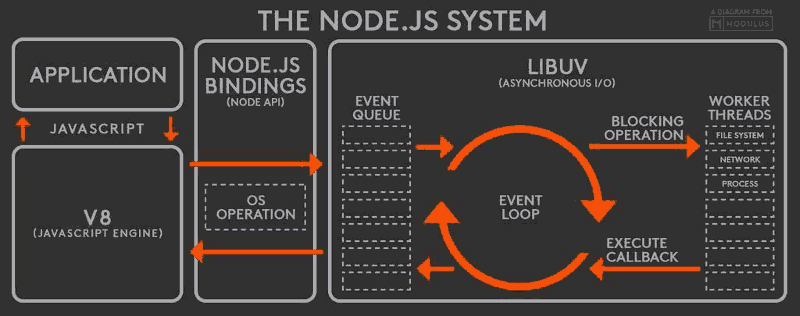

# NodeJS 处理高并发

## 为什么要异步I/O?
|I/O类型|花费的CPU时钟周期|备注|
|---|---|---|
|CPU一级缓存|3||
|CPU二级缓存|14||
|内存|250||
|硬盘|41000000|<- 大约是内存的16万倍|
|网络|240000000||

## 为什么单线程却能够支持高并发?
> I/O 包括: 数据库操作、操作缓存、网络IO、文件读写等

+ 前提条件: I/O密集型任务, 采用 **异步I/O**
+ **单线程**: 主从模式, 一个主线程(Master)负责调度, 多个工作进程(Worker)
+ **事件驱动**: 主循环加事件触发的方式
+ 分布式架构: Nginx负载均衡 + Node集群

## NodeJS 运行机制

流程:
1. V8引擎解析JS脚本
2. 解析后调用 NodeJS API
3. 进入事件循环, 立刻返回状态, 异步返回任务的执行结果给V8引擎
4. V8引擎将结果返回给用户

## 单线程的好处
1. 相比于多线程:
    + 单线程的内存占用低
    + 没有线程切换的开销, 多了一个 Event Loop 开销
2. 程序简单, 没有锁、状态同步
3. 线程安全

## 单线程的坏处
1. 无法利用多核CPU
2. 大量CPU计算会导致应用阻塞 (不适合CPU密集型)
3. 单线程异常后, 程序将推出 (解决方法: 主从模式, 线程平滑重启)