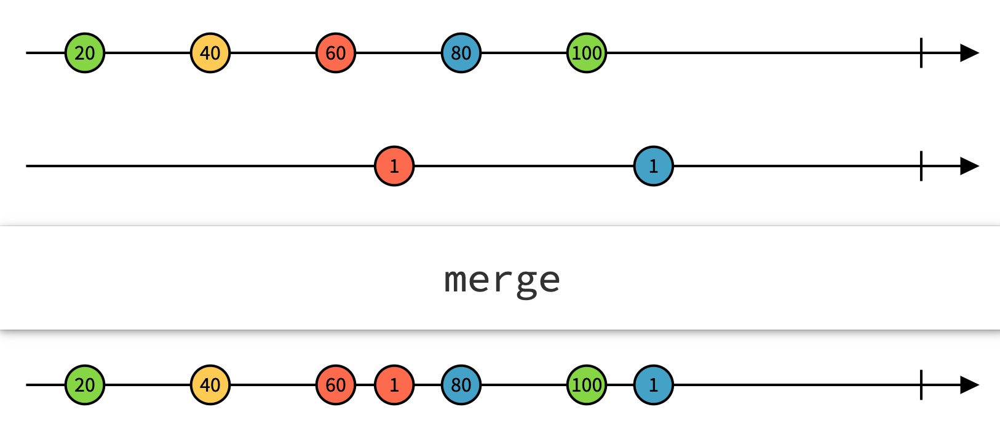

# RxJS 概念

内容还没有整理, 知识点比较零散.

## Reactive Extension
Rx 的概念起源于微软的 .Net, Rx 有多个语言版本: [RxJava](https://github.com/ReactiveX/RxJava), [RxPy](https://github.com/ReactiveX/RxPY), [RxCpp](https://github.com/ReactiveX/RxCpp).

RxJS 是一个处理事件流的库.

RxJS 是基于观察者模式和迭代器模式实现的.

在编程中, "Pull" 和 "Push" 是从数据消费者的角度的描述,
1. Pull: web 页面发起一个 ajax 查询得到数据后展示
2. Push: 服务器直接向 web 页面推送数据

RxJS 是基于 "Push" 式的迭代器实现.


## 函数式编程(FP) 和 面向对象编程(OOP)
函数式编程的三个要求:
1. 声明式 (Declarative)
2. 纯函数 (Pure Function)
    + 函数的执行过程完全由输入参数决定, 不会受除参数外的的任何数据影响;
    + 函数不会修改任何外部状态;
3. 数据不可变 (Immutability)


## 响应式编程(RP) 和 指令式编程 (IP)

[维基百科 - 响应式编程](https://zh.w]ikipedia.org/wiki/响应式编程), 
[维基百科 - 指令式编程](https://zh.wikipedia.org/wiki/指令式編程)

jQuery 是命令式的, 需要手动设置 `h1` 标签的内容
```html
<h1 id="counter"></h1>
<button id="addBtn">+</button>

<script>
    var counter = 0;
    $("#addBtn").click(function () {
        counter += 1;
        
        // 需要手动设置
        $("#counter").html(counter);
    });
</script>
```

Vue 是响应式的, 页面**自动响应**数据的变化
```html
<div id="DemoApp">
    <h1>{{counter}}</h1>
    <button @click="add()">+</button>
</template>

<script>
new Vue({
    el: "#DemoApp",
    data () {
        return {
            counter: 0
        }
    },
    methods: {
        add() {
            // 只需改动数据源, 页面会自动变化
            this.counter += 1;
        }
    }
});
</script>
```

## Observable = Publisher + Iterator

Observable 和 Observer 的概念类似于医院的挂号系统:

病人 (Observer) 去医院以后, 先去护士台 (Observable) 挂号, 即 Observer 订阅 Observable, 开始叫号的时候, 护士台会发出广播依次通知所有的病人 (Iterator), 病人都可以知道目前的号码, 病人判断是否轮到自己, 执行不同的逻辑 (Publish Callback).

对于中午12点来挂号的张三, 是否需要知道上午所有的号码? 

这里对应了两种模式:
- **Hot Observable**: 不需要, 只需要接受从订阅那一刻开始产生的数据
- **Code Observable**: 需要, 获取 Observable 之前所有的数据

Rx 同时支持这两种模式.

## 操作符
一个操作符是返回 Observable 对象的函数, 目前有 70 多个操作符.

操作符类似于 Lodash 提供的各种工具方法, 通过操作符的组合实现你自己的 "操作符",
不同的是, Lodash 操作的是数据, Rx 操作的是事件流.

根据用途可以分为三种:
- 凭空创建 Observable 对象
- 根据外部数据创建 Observable 对象
- 接受 Observable 返回新的 Observable

根据功能可以分为以下类别:
- 创建类
- 转化类
- 过滤类
- 合并类
- 多播类
- 错误处理类
- 辅助工具类
- 条件分支类
- 数学和合计类

弹珠图: 通过弹珠的流转形象的描述操作符的作用, Merge 操作符的弹珠描述如下图:



相关链接:
- [完整的操作符列表](https://rxjs-cn.github.io/learn-rxjs-operators/operators/complete.html)
- [弹珠图工具](https://rxmarbles.com/)
- [Rx 代码转为弹珠图](https://rxviz.com/)

## 创建同步的数据流

### create

create 是最简单的操作符, 它的功能是直接调用 Observable 的构造函数, 返回一个 Observable 对象.

```javascript
Observable.create = function (subscribe) {
    return new Observable(subscribe);
}
```

### of 
of 操作符适用于已知不多的几个数据.

```javascript
testOf() {
    const source$ = Observable.of("Hello RxJS");
    source$.subscribe(text => {
        console.log(text);
        // output:
        // => Hello RxJS
    });
}
```

### range

```javascript
testRange() {
    const source$ = Observable.range(1, 10);
    source$.subscribe(num => {
        console.log(num);
        // output:
        // 1
        // 2
        // ...
        // 10
    });
}
```

### generate

generate 操作符相当于 for 循环:

```javascript
const result = [];
for (let i = 2; i < 10; i += 2) {
    result.push(i * i);
}
```

```javascript
testGenerate() {
    /**
     * generate 是 for 循环的变种
     */
    // for (let i = 0; i <= 10; i++) {
    //     console.log(i * 2);
    // }
    const source$ = Observable.generate(
        0,
        value => value <= 10,
        value => value + 1,
        value => value * 2
    );
    source$.subscribe(num => {
        console.log(num);
        // output:
        // 0
        // 2
        // 4
        // ...
        // 20
    });
}
```

### repeat

repeat 操作符相当于 while 循环??

```javascript
const source$ = Observable.of(1, 2, 3); 
const repeated$= source$.repeat(10);
```

### empty, never, throw

```javascript
// 产生一个直接完结的数据流
const source1$ = Observable.empty();

// 产生一个直接出错的数据流
const source2$ = Observable.throw(new Error('Oops'));

// 产生一个永不完结的数据流
const source3$ = Observable.never();
```

## 创建异步操作流

### interval 和 timer

```javascript
testInterval() {
    const source$ = Observable.interval(1000);
    source$.subscribe(num => {
        console.log(num);
        // output: 每次输出间隔一秒
        // => 0
        // => 1
        // => ...
    });
}
```

## 相关文章
- [10 Need-to-Know RxJS Functions with Examples](https://www.sitepoint.com/rxjs-functions-with-examples/)