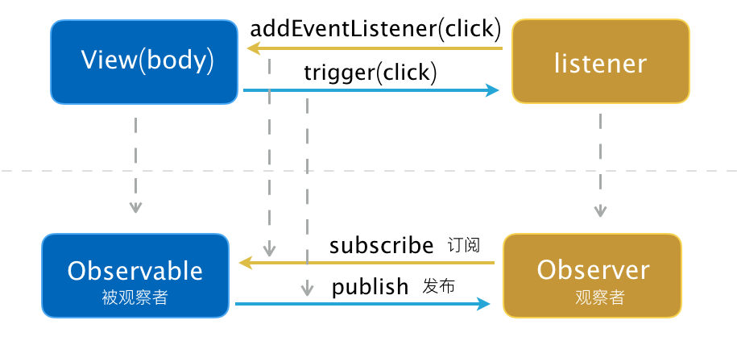

# 观察者模式

观察者模式在 Web 中最常见的应该是 DOM 事件的监听和触发.

1. **订阅**: 通过 `addEventListener` 订阅 `body` 的点击事件.
2. **发布**: 当 `body` 被点击时, 通知所有的订阅者.

`body` 是 Observable, `clickListener` 函数是 Observer.

```javascript
function clickListener (e) {
  console.log(e);
}

document.body.addEventListener('click', clickListener, false);

// 触发一次点击事件
document.body.click();
```

上述例子对应到观察者模型中: 


## JavaScript 实现

PubSub 需要提供三个方法:

1. 订阅 subscribe
2. 取消订阅 unsubscribe
3. 发布 publish

Topics 描述如下:

```typescript
interface Subscriber {
    token: string;
    func: Function
}

interface Topic {
    topicName: <Subscriber>[]
}
```

```javascript
// pub-sub.js
export default class PubSub {
  constructor() {
		this.topics = {};
    this.lastUid = -1;
  }
  
  subscribe(topic, func) {
    if (!this.topics[topic]) {
    	this.topics[topic] = [];
    }
    
    const token = (++this.lastUid).toString();
    this.topics[topic].push({
    	token,
      func
    });
    return token;
  }
  
  unsubscribe(token) {
    for (let topic in this.topics) {
    	if (this.topics.hasOwnProperty(topic)) {
				this.topics[topic].forEach((subscriber, i) => {
        	if (subscriber.token === token) {
	          this.topics[topic].splice(i, 1);
          }
        });
      }
    }
    return this;
  }
  
  publish(topic, ...rest) {
    if (!this.topics[topic]) {
	    return false;
    }
    
    this.topics[topic].forEach(subscriber => {
    	subscriber.func(...rest);
    });
    return this;
  }
}
```

使用方式:

```javascript
// demo.js
import PubSub from './pub-sub.js'

const PS = new PubSub();
const token = PS.subscribe('hello', function (msg) {
	console.log('Receive Data: ', msg);
});

PS.publish('hello', 'hey'); // => Receive Data: hey
PS.unsubscribe(token); // 取消订阅
PS.publish('hello', 'hey again'); // 无输出
```

⚠️ 生产环境请使用 [PubSubJS](https://github.com/mroderick/PubSubJS).