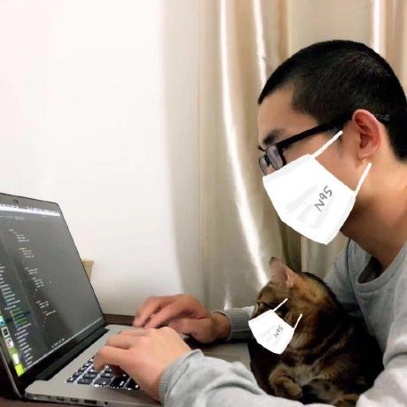

此仓库用于存储我的代码片段、速查表、读书笔记等, 联系我: [我的主页](https://rmlzy.com), [Github](https://github.com/rmlzy)

我的其他项目:
+ [Http Cat](https://www.rmlzy.com/http-cat.html): 用我的猫咪描述 HTTP 状态码;
+ [cra-admin-starter](https://github.com/fs-coder/cra-admin-starter): 基于 CRA 的中后台系统模板;
+ [js-fullstack-starter](https://github.com/fs-coder/js-fullstack-starter): 基于 React, Beidou 等技术的 JS 全栈开发项目模板;
+ [ng-admin-starter](https://github.com/fs-coder/): 一个基于 Angular 7.2.0 和 ng-zorro 的中后台系统模板;

