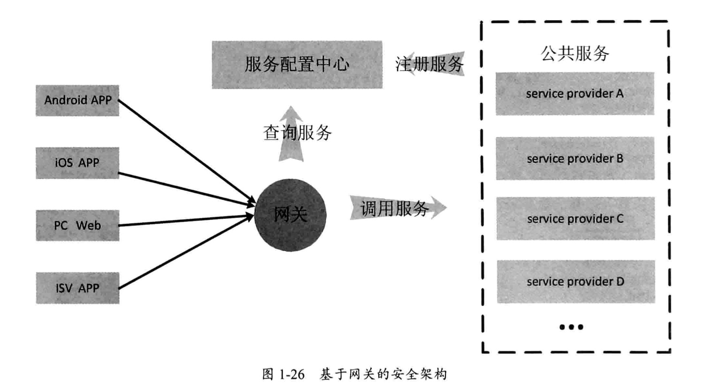

# 读《大型分布式网站架构设计与实践》

## 负载均衡算法

1. 轮询(Round Robin), 将请求按顺序轮流分配给服务器;
1. 随机(Random), 将请求随机分配给服务器;
1. 源地址哈希法(Hash), 获取客户端的IP, 统一IP地址的请求始终分配给同一台服务器;
1. 加权轮询(Weight Round Robin), 不同配置的服务器配置权重, 按权重分配;
1. 加权随机(Weight Random), 按照权重随机分配;
1. 最小连接数法(Least Connections), 根据服务器当前的连接情况, 动态选取链接数最少的一台服务器处理请求;

## 网关 Gateway

网关的作用: 
1. 接受各种客户端的请求, 完成响应的权限与安全校验
1. 校验通过后, 到服务配置中心查询服务, 通过负载均衡算法选取服务器发起调用
1. 透传客户端参数给服务器, 将服务器处理后的结果返回给客户端

## 常见的安全算法
### 1) 数字摘要
1. MD5
1. SHA
1. 十六进制编码
1. Base64编码
1. 彩虹表破解 Hash 算法

### 2) 对称加密算法
1. DES
1. AES

### 3) 非对称加密算法
1. RSA

### 4) 数字签名
1. MD5withRSA
2. SHA1withRSA

### 5) 数字证书
